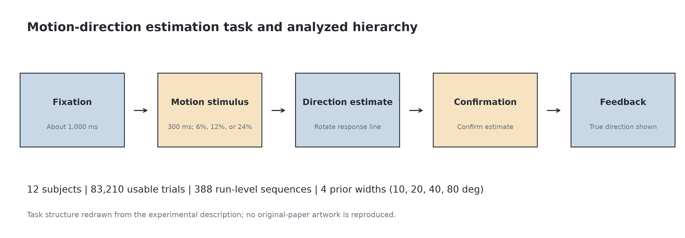
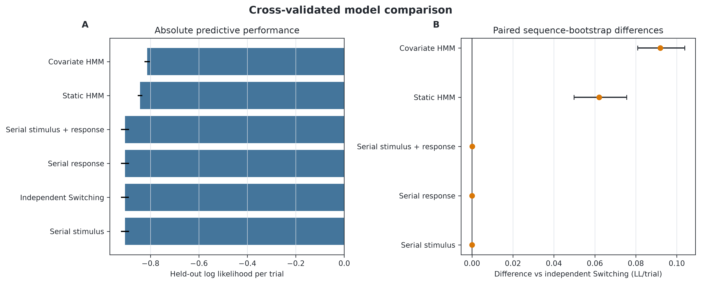
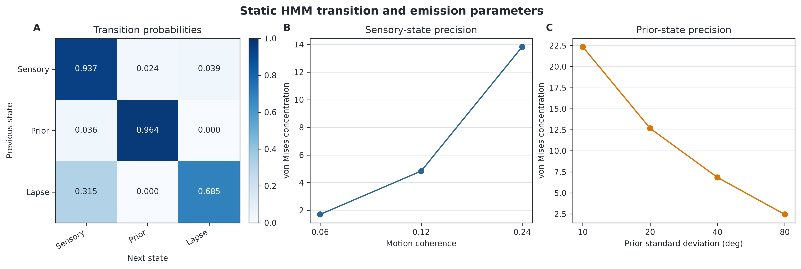
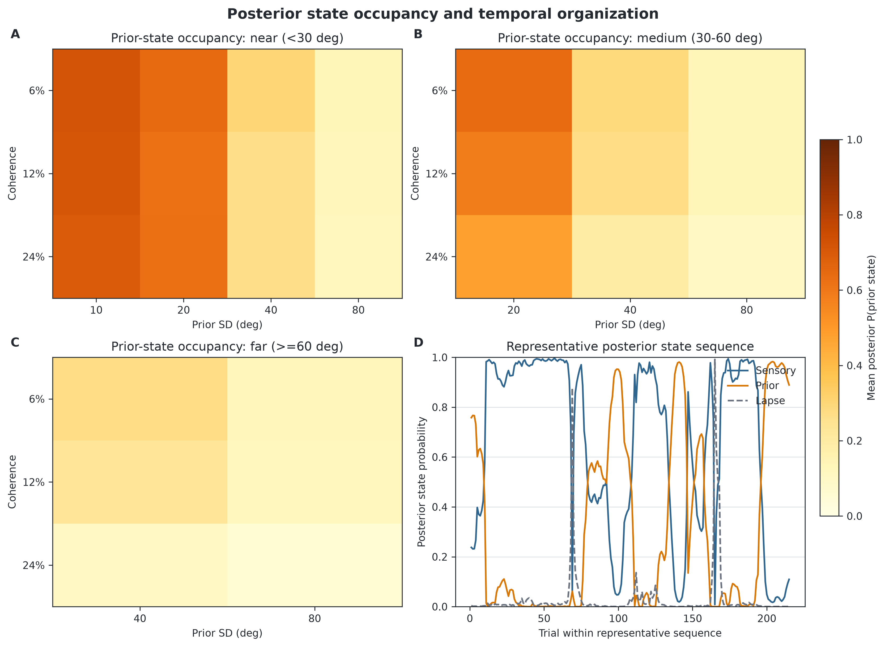
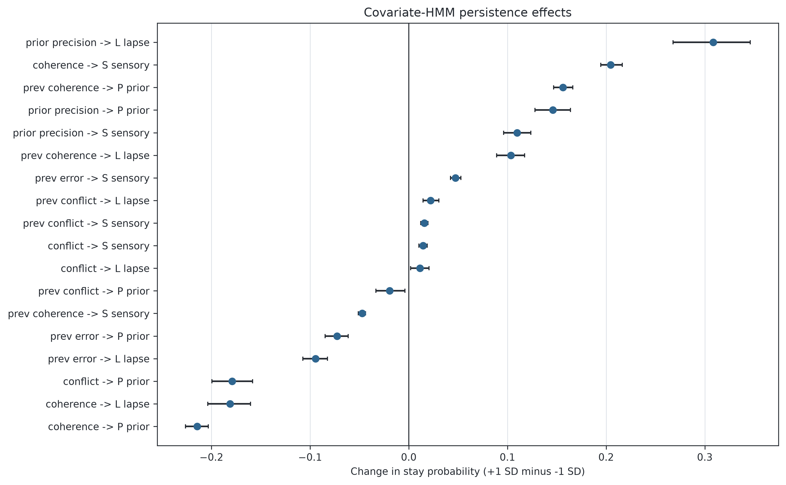
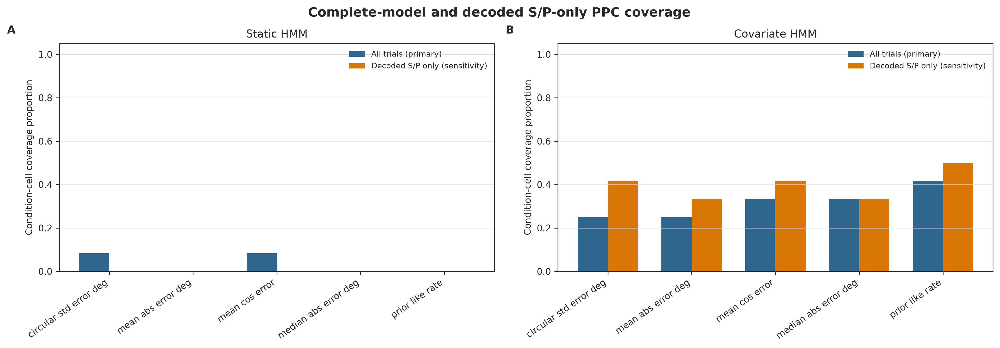

# Temporal Persistence of Perceptual Inference

**Team Doraemon, Neuromatch Computational Neuroscience 2026**

Bayesian observers explain perception as the combination of uncertain sensory evidence and prior expectations. Yet trial-level estimates in the motion-direction experiment of Laquitaine and Gardner can cluster around either the current stimulus or the learned prior. A memoryless Switching Observer captures this bimodality by selecting a response strategy independently on every trial, but it does not ask whether inference modes persist over time.

This project tests a temporal alternative: observers may occupy persistent latent **sensory-reliant**, **prior-reliant**, or **lapse** states and transition between those states across trials.

[Final slides](presentation/temporal_persistence_perceptual_inference.pptx) | [Abstract](ABSTRACT.md) | [Self-contained technical report](perceptual_arbitration/results/report/perceptual_arbitration_results.html) | [Main analysis code](perceptual_arbitration/) | [Limitation analysis](Limitation_Analysis_of_HMM_Temporal_Persistence/)



## Study design

We reanalysed the four-prior motion-direction experiment reported by Laquitaine and Gardner (2018). Participants viewed a noisy random-dot motion stimulus and estimated its direction. Motion coherence manipulated sensory reliability, while four prior widths manipulated uncertainty about the learned distribution of directions.

The analysis preserves the experimental temporal hierarchy:

| Quantity | Value |
|---|---:|
| Participants | 12 |
| Raw rows | 83,213 |
| Usable estimates | 83,210 |
| Independent subject-session-run sequences | 388 |
| Motion coherence levels | 0.06, 0.12, 0.24 |
| Prior standard deviations | 10, 20, 40, 80 degrees |
| Cross-validation | 4-fold, run-level |

Three rows with missing response coordinates are excluded. Previous-trial covariates never cross a run boundary, and transition-covariate scaling is fitted on training sequences only during cross-validation.

## Models

All response models operate on circular directions. Sensory and prior emissions use von Mises densities; the lapse emission is circular uniform.

| Model | Temporal assumption | Purpose |
|---|---|---|
| Independent Switching | Trial-independent component weights | Memoryless Switching Observer baseline |
| Serial stimulus | One-back sensory-center shift | Tests attraction to the previous stimulus |
| Serial response | One-back sensory-center shift | Tests attraction to the previous response |
| Serial stimulus + response | Two one-back shifts | Combined serial baseline |
| Static HMM | One fixed transition matrix | Tests persistent latent inference states |
| Covariate HMM | Trial-specific transition matrices | Tests whether reliability, uncertainty, conflict, and recent history predict switching |

Models were fitted with deterministic multistart optimization and compared by held-out log predictive density. Complete run sequences, rather than individual trials, are the cross-validation and bootstrap units.

## Main predictive results

The covariate HMM was the strongest predictor **within the prespecified six-model comparison**.

| Model | Held-out LL/trial | Difference from independent switching |
|---|---:|---:|
| Covariate HMM | **-0.8133** | **+0.0919** |
| Static HMM | -0.8432 | +0.0621 |
| Serial stimulus + response | -0.9051 | +0.0001 |
| Serial response | -0.9052 | +0.0001 |
| Independent Switching | -0.9053 | reference |
| Serial stimulus | -0.9053 | approximately 0 |

The sequence-bootstrap 95% interval was `[0.0810, 0.1039]` LL/trial for the covariate HMM and `[0.0498, 0.0756]` for the static HMM. Exponentiating these differences gives predictive-density ratios of approximately **1.096** and **1.064** per response.



## Persistent latent states

The final static HMM estimated high sensory and prior self-transition probabilities:

| Transition parameter | Estimate | Homogeneous geometric-run interpretation |
|---|---:|---:|
| Sensory to sensory, `A_SS` | 0.937 | about 16 trials |
| Prior to prior, `A_PP` | 0.964 | about 28 trials |
| Lapse to lapse, `A_LL` | 0.685 | about 3 trials |

The sensory emission becomes more concentrated as coherence increases, while prior-emission concentration changes with prior width. These condition-indexed concentrations describe response precision; they are not state probabilities.



State occupancy varies with coherence, prior uncertainty, and stimulus-prior conflict, and participant-specific fits show substantial heterogeneity.



## Covariate-dependent switching

The covariate HMM allows every transition row to change with current coherence, prior precision, stimulus-prior conflict, previous error, previous conflict, and previous coherence. Contrasts are evaluated at `+1 SD` versus `-1 SD` using the training-derived scaler. They are conditional associations, not causal effects.

The final presentation additionally reports supplementary multinomial and survival analyses of inferred state occupancy and persistence. With the prior state as the reference, the prior-uncertainty by coherence interaction was reported for the sensory state as `beta = 0.37`, 95% CI `[0.34, 0.40]`, and for the lapse state as `beta = 0.07`, 95% CI `[0.03, 0.11]`. These downstream analyses are presentation-level supplements and are distinct from the generative covariate-HMM fitting code in `perceptual_arbitration/`.



## Posterior predictive adequacy

Relative predictive superiority does not guarantee that a model reproduces all important features of the data. One hundred complete replicated datasets were generated from each final HMM while preserving the observed experimental design.

| PPC scope | Static HMM | Covariate HMM |
|---|---:|---:|
| All trials, primary check | 2/60 cells covered | 19/60 cells covered |
| Decoded S/P-only sensitivity | 0/60 cells covered | 24/60 cells covered |

The covariate HMM improves selected calibration metrics but still shows substantial absolute misfit. The S/P-only analysis excludes smoothed marginal-MAP lapse classifications symmetrically from observed and simulated response summaries. It is not Viterbi decoding, does not provide an online lapse detector, and does not replace the all-trial check.



## Important limitation: persistence is not uniquely Markovian

The teammate contribution in [`Limitation_Analysis_of_HMM_Temporal_Persistence/`](Limitation_Analysis_of_HMM_Temporal_Persistence/) tests whether high diagonal HMM transitions uniquely imply a first-order psychological switching process.

Its within-block permutation control preserves block composition while disrupting local order. Prediction worsens, indicating useful temporal information, but diagonal dominance remains. Its exchangeable block mixture and block-plus-Markov hybrid further show that slow block-level heterogeneity can explain substantial predictive structure. In those separate comparisons, the hybrid has the best held-out likelihood, although several fits do not meet the strict convergence criterion.

The combined conclusion is therefore narrower than "the HMM is the true process":

1. Persistent latent-state models predict held-out responses better than memoryless switching and the tested one-back serial baselines.
2. Inferred sensory and prior modes persist over multiple adjacent trials.
3. Covariates predict conditional changes in occupancy and transition behavior.
4. Static and covariate HMMs remain incomplete generative descriptions under posterior predictive checking.
5. High HMM self-transition probabilities alone do not identify a unique first-order psychological mechanism; participant- and block-level structure may contribute.

## Repository structure

```text
.
|-- ABSTRACT.md
|-- presentation/
|   `-- temporal_persistence_perceptual_inference.pptx
|-- perceptual_arbitration/
|   |-- configs/                 # publication configuration
|   |-- scripts/                 # fitting, PPC, exports, and rendering CLIs
|   |-- src/perceptual_arbitration/
|   |-- tests/
|   |-- PROPOSAL.md              # mathematical and scientific specification
|   `-- results/                 # curated tables, figures, report, provenance
`-- Limitation_Analysis_of_HMM_Temporal_Persistence/
    `-- HMM, shuffle, block-mixture, and hybrid analyses
```

## Reproduce the main analysis

### 1. Create an environment

```powershell
git clone https://github.com/JustinZHAO-05/Temporal-Persistence-of-Perceptual-Inference-by-Group-Doraemon-Neuromatch-CN-2026.git
cd Temporal-Persistence-of-Perceptual-Inference-by-Group-Doraemon-Neuromatch-CN-2026
python -m venv .venv
.\.venv\Scripts\Activate.ps1
pip install -e .\perceptual_arbitration
```

### 2. Prepare the data

```powershell
Copy-Item `
  .\Limitation_Analysis_of_HMM_Temporal_Persistence\HMM\01_full_data_fit\data\data01_direction4priors.csv `
  .\perceptual_arbitration\data\data01_direction4priors.csv
```

The public dataset is also available from Mendeley Data under CC BY 4.0.

### 3. Run a fast check

```powershell
cd perceptual_arbitration
python scripts/run_fast_replication.py --csv data/data01_direction4priors.csv --out outputs/fast --restarts 2 --max-iter 100
```

### 4. Run the publication configuration

```powershell
python scripts/run_all.py --config configs/default.yaml --resume --n-jobs 4
```

The publication run is computationally expensive. Deterministic checkpoints allow interruption and resume without changing restart seeds or model definitions.

### 5. Validate

```powershell
python -m pytest -q
python -m compileall -q src scripts tests
```

The curated snapshot passed 36 tests. The final report is a portable, self-contained HTML file and can be shared without its surrounding directory.

## Reproducibility map

| Claim or artifact | Public location |
|---|---|
| Main six-model comparison | `perceptual_arbitration/src/`, `scripts/run_all.py`, `results/tables/` |
| Transition and emission parameters | `results/tables/hmm_final_*` |
| Covariate-HMM effects | `results/tables/covariate_hmm_*` |
| Posterior predictive checks | `scripts/run_posterior_predictive_checks.py`, `results/tables/posterior_predictive_*` |
| Complete teaching/technical report | `results/report/perceptual_arbitration_results.html` |
| Trial-order and block-level limitations | `Limitation_Analysis_of_HMM_Temporal_Persistence/` |
| Supplementary multinomial/survival summaries | final slides and `ABSTRACT.md`; separate from the main package |

## Scientific scope

The data are behavioral. Latent states are computational constructs inferred under fitted models; they are not direct observations of neural states. Covariate associations are conditional rather than causal. Bootstrap tail proportions are not conventional independent-sample p-values, and posterior predictive coverage is a diagnostic rather than a formal accept/reject test.

## Citation and data source

Laquitaine, S., & Gardner, J. L. (2018). A switching observer for human perceptual estimation. *Neuron, 97*(2), 462-474.e6. https://doi.org/10.1016/j.neuron.2017.12.011

Laquitaine, S. (2018). *A switching observer for human perceptual estimation* [Dataset]. Mendeley Data, Version 1. https://doi.org/10.17632/nxkvtrj9ps.1

## License

Repository software is released under the [MIT License](LICENSE). The source dataset is distributed under the license stated by its original repository and should be cited separately.
